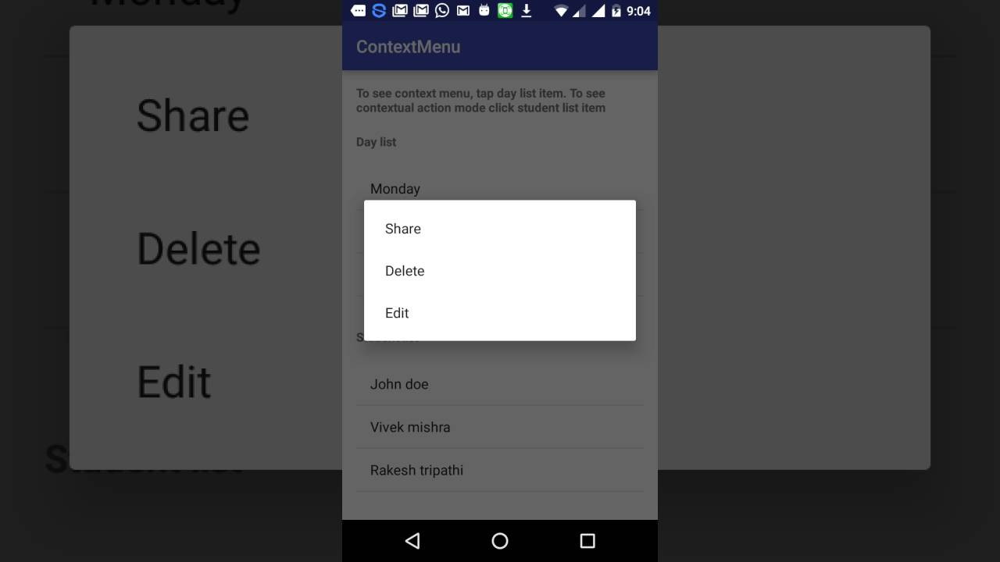

# Title: Menus
Tags: android menus, navigation

## Objectives

* Understand the different kinds of menus
* Be able to define an Options menus in XML
* Be able to define a Contextual menu
* Creating a Popup menu
* Creating a floating context menu

## Warm up

Create an android app called MenuApp.

Add two activities MainActivity and SecondActivity with their respective layout files

Add a text view on MainActivity that reads "MainActivity"

Add a button to MainActivity, "Go to Second", that launches SecondActivity using startActivity

Add a text view on SecondActivity that reads "SecondActivity"


## Resources

[Android Menu Reference] (https://developer.android.com/guide/topics/ui/menus.html)

## What are Menus?

*def* It's an android component that presents more actions and options in your activities.

There are three main types:

1. Options menu (in the app bar)

2. Contextual menu (in contextual action mode)

3. Popup menu 


## Options menu and app bar

*def* The options menu is the primary (main) collection of menu items for an activity. 

It's where you should place actions that have a global impact on the app, such as "Search," "Compose email," and "Settings."


## Context menu and contextual action mode

*def* A context menu is a floating menu that appears when the user performs a long-click on an element. 

It provides actions that affect the selected content or context frame.

The contextual action mode displays action items that affect the selected content in a bar at the top of the screen and allows the user to select multiple items.



## Popup menu

*def* A popup menu displays a list of items in a vertical list that's anchored to the view that invoked the menu. 

It's good for providing an overflow of actions that relate to specific content or to provide options for a second part of a command. 

Actions in a popup menu should not directly affect the corresponding content—that's what contextual actions are for. Rather, the popup menu is for extended actions that relate to regions of content in your activity.

## Defining a Menu in XML

* Define a menu and all its items in an XML menu resource or create in Java. 

* You can then inflate the menu resource (load it as a Menu object) in your activity or fragment.

* To define the menu, create an XML file inside your project's res/menu/ directory 

## Anatomy of Menu xml

Here's an example menu named game_menu.xml:

```xml
<?xml version="1.0" encoding="utf-8"?>
<menu xmlns:android="http://schemas.android.com/apk/res/android">
    <item android:id="@+id/new_game"
          android:icon="@drawable/ic_new_game"
          android:title="@string/new_game"
          android:showAsAction="ifRoom"/>
    <item android:id="@+id/help"
          android:icon="@drawable/ic_help"
          android:title="@string/help" />
</menu>
```

`<menu>` - defines a Menu, which is a container for menu items. It must be the root node for the file and can hold one or more `<item>` and `<group>` elements.

`<item>` - Creates a MenuItem, which represents a single item in a menu. This element may contain a nested `<menu>` element in order to create a submenu.

`<group>` - An optional, invisible container for `<item>` elements. It allows you to categorize menu items so they share properties such as active state and visibility.

## Creating an Options Menu

To specify the options menu for an activity, override `onCreateOptionsMenu()`.  In this method, you can inflate your menu resource (defined in XML) into the Menu provided in the callback.

For example:
```java
@Override
public boolean onCreateOptionsMenu(Menu menu) {
    MenuInflater inflater = getMenuInflater();
    inflater.inflate(R.menu.game_menu, menu);
    return true;
}
```

## Try the above in Android studio before continuing

## Handling Click Events

When the user selects an item from the options menu (including action items in the app bar), the system calls your activity's onOptionsItemSelected() method. 

This method passes the MenuItem selected. You can identify the item by calling getItemId(), which returns the unique ID for the menu item (defined by the android:id attribute in the menu resource)

```java
@Override
public boolean onOptionsItemSelected(MenuItem item) {
    // Handle item selection
    switch (item.getItemId()) {
        case R.id.new_game:
            newGame();
            return true;
        case R.id.help:
            showHelp();
            return true;
        default:
            return super.onOptionsItemSelected(item);
    }
}
```

## Creating Contextual menus

There are two ways to provide contextual actions:

* *In a floating context menu*. A menu appears as a floating list of menu items (similar to a dialog) when the user performs a long-click (press and hold) on a view that declares support for a context menu. Users can perform a contextual action on one item at a time.

* *In the contextual action mode*. This mode is a system implementation of ActionMode that displays a contextual action bar at the top of the screen with action items that affect the selected item(s). When this mode is active, users can perform an action on multiple items at once (if your app allows it).


# Creating Pop Up menu

Useful for providing an overflow-style menu for actions that relate to specific content or for providing a drop-down similar to Spinner that does not retain a persistent selection

To create a pop up menu:

1. Define your menu in XML

2. Instantiate a PopupMenu with its constructor, which takes the current application Context and the View to which the menu should be anchored.

3. Use MenuInflater to inflate your menu resource into the Menu object returned by PopupMenu.getMenu().

4. Call PopupMenu.show().


# Creating a floating context menu

1. Register the View to which the context menu should be associated by calling registerForContextMenu() and pass it the View.

2. Implement the onCreateContextMenu() method in your Activity or Fragment and inflate the menu.
For example:
```java
@Override
public void onCreateContextMenu(ContextMenu menu, View v,
                                ContextMenuInfo menuInfo) {
    super.onCreateContextMenu(menu, v, menuInfo);
    MenuInflater inflater = getMenuInflater();
    inflater.inflate(R.menu.context_menu, menu);
}
```

The callback method parameters include the View that the user selected and a ContextMenu.ContextMenuInfo object that provides additional information about the item selected. If your activity has several views that each provide a different context menu, you might use these parameters to determine which context menu to inflate.

3. Implement onContextItemSelected().
For example:
```java
@Override
public boolean onContextItemSelected(MenuItem item) {
    AdapterContextMenuInfo info = (AdapterContextMenuInfo) item.getMenuInfo();
    switch (item.getItemId()) {
        case R.id.edit:
            editNote(info.id);
            return true;
        case R.id.delete:
            deleteNote(info.id);
            return true;
        default:
            return super.onContextItemSelected(item);
    }
}
```

For example, here's a button with the android:onClick attribute that shows a popup menu:
```xml
<ImageButton
    android:layout_width="wrap_content"
    android:layout_height="wrap_content"
    android:src="@drawable/ic_overflow_holo_dark"
    android:contentDescription="@string/descr_overflow_button"
    android:onClick="showPopup" />
```

The activity can then show the popup menu like this:
```java
public void showPopup(View v) {
    PopupMenu popup = new PopupMenu(this, v);
    MenuInflater inflater = popup.getMenuInflater();
    inflater.inflate(R.menu.actions, popup.getMenu());
    popup.show();
}
```


# Summary

* We learned the different kinds of menus
    - Popup, Contextual and Options menu

* Menus are defined like other android layout components using XML

* They are inflated by the activities that need them via `onCreateOptionsMenu`

* Click events are handled differently by different menus


# Exercises

**Question 1** 
Create an activity with the options menu in the diagram below:


**Question 2**
In the same app, create an activity ContextMenuActivity.

It should contain a button, "Launch context menu", which when clicked:

Would launch a context menu with the items "Add", "Edit", "Delete".

[Optional] Add onclick handlers for the items so that when user presses "Add",
It would log "'Add' from context menu clicked"
