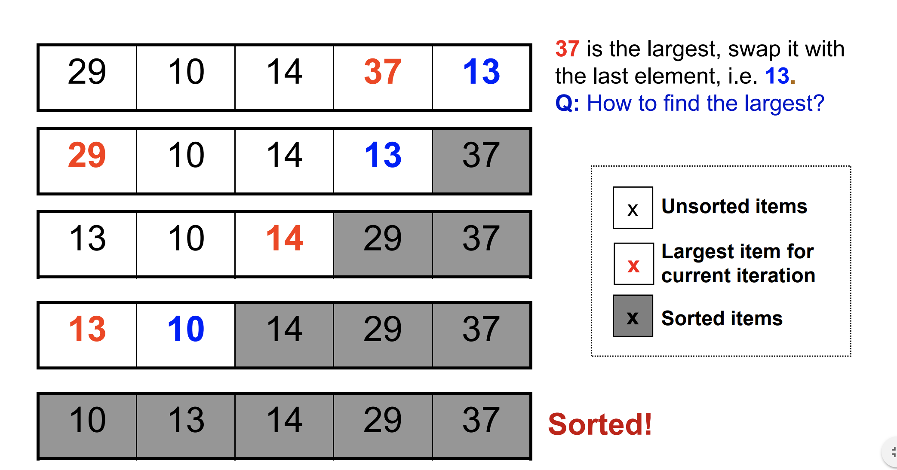

# Title: Sorting Algorithms
Tags: runtime, algorithms, bubble sort, insertion sort, quick sort merge sort

# Objectives

- Know the different strategies used in sorting algorithms
- Know the different properties of sorting algorithms
- Understand runtime complexity in the context of sorting
- Understand recursion in the context of sorting
- Gain exposure to sorting algorithms like Bubble Sort, Insertion Sort, Quick Sort and Merge Sort.

# Resources

- [Khan Academy](https://www.khanacademy.org/computing/computer-science/algorithms/insertion-sort/a/insertion-sort)
- [Wikipedia](https://en.wikipedia.org/wiki/Insertion_sort)
- [Swift Algorithm Club](https://github.com/raywenderlich/swift-algorithm-club/tree/master/Insertion%20Sort)
- [CS50 - Bubble Sort](https://study.cs50.net/bubble_sort)
- [Quick Sort](https://interactivepython.org/runestone/static/pythonds/SortSearch/TheQuickSort.html)
- [Concise lecture on sorting](https://www.comp.nus.edu.sg/~stevenha/cs1020e/lectures/L10%20-%20Sorting.pdf)

# Sorting

We do it everyday... 
We see it in action everyday... 

### Why study sorting

* When an input is sorted, many (hard) problems become relatively easy, like:

* Efficient Searching
* Extracting k-th smallest items
* Uniqueness testing
* Deleting duplicates
* Finding Min and max
* Prioritizing events
* Frequency counting
* Reconstructing the original order
* Set intersection/union
* Finding a target pair x, y such that x+y = z

### Visual examples of applications

* Find a red ball with "A" written on it in a messy pile of balls
* Handing out results in alphabetical order vs score

## Sorting strategies

Iterative sorting algorithms (comparison based)
* Selection Sort
* Bubble Sort
* Insertion Sort

Recursive sorting algorithms (comparison based)
* Merge Sort
* Quick Sort

## Properties of Sorting algorithms
* *Time complexity*: How long it takes to sort
* *Space complexity*: How much space it needs to sort 
* *Stability*: Does it preserve the order of equal items? Like multi-column sort in excel

Sorting has a variety of interesting algorithmic solutions that embody many ideas
* Comparison vs non-comparison based
* Iterative vs Recursive
* Divide-and-conquer
* Best/worst/average-case bounds
* Randomized algorithms

## The most import metric - Time!

There is no *silver-bullet* sorting algorithm. Some generally perform better in metrics we care about.


|Sorting function|Runtime|
|---|---|
|Insertion Sort| O(n<sup>2</sup>)
|Bubble Sort| O(n<sup>2</sup>)
|Merge Sort| O(nlog(n))
|Quicksort | O(nlog(n))

## What we know so far

```java
List<Integer> list = new ArrayList<Integer>();

list.add(11);
list.add(2);
list.add(7);
list.add(3);

Collections.sort(list);
```

## Selection Sort


**The idea**

Given an array of n items
1. Find the largest item x, in the range of [0...n−1]
2. Swap x with the (n−1)th item
3. Reduce n by 1 and go to Step 1

**Selection sort illustration**



**Selection sort implementation**

```java
public void selectionSort(int[] arr) {
    for (int n = arr.length; n > 0; n--) {
        // step 1: find largest element
        int largest = 0;
        for(int i = 0; i < n; i++) {
            if (arr[i] > arr[largest]) {
                largest = i;
            }
        }
        // step 2: swap the elements
        int tmp = arr[largest];
        arr[largest] = arr[n-1];
        arr[n-1] = tmp;
    }
}
```

## Crash-course on runtime analysis

* O(n) is pronounced as "Big O of n", so O(n<sup>2<sup>) is "Big O of n squared"
* Big O is an upper bound on how long an operation would take. It's only an **approximation**!
* O(1) means constant time
    - takes the same time regardless of the size of the input
    - the time never grows (this is the fastest - the holy grail of all algorithms)
    - For example: If it takes 1 sec to sort an array of 1 item, it will still take 1 sec to sort an array of 1 million items
    - In code, some O(1) operations include:
        * assignment statements: `int x = 0;` 
        * conditional statements: `if (x == 2 && y == 3 && z == 4) { ... }`
* O(log n) means logarithmic time
    - takes *much less* time than the size of the input
    - the time grows much slower than input but not a constant
    - We'll revisit logarithmic time. More realistic to achieve than O(1)
    - In code, log n operations are common in divide and conquer algorithms (which we'll also visit later)
* O(n) means linear time 
    - takes as long as the size of the input 
    - the time grows just as fast as the input. 
    - For example: If it takes 1 sec to sort an array of 1 item then it will take 9 seconds to sort an array of 9 items
    - How long will it take to sort an array of 1 million items?
    - In code, some O(n) operations include:
        * loops (single): `for (int i = 0; i < 10; i++) {...}`
* O(n<sup>2</sup>) is quadratic time 
    - takes a square of the size of the input
    - the time grows much faster than the input. 
    - For example: If it takes 1 sec to sort 1 item, it will take 81 secs (9*9) to sort an array of 9 items. 
    - How long will it take to sort an array of 1 million items?
    - In code, some O(n2) operations include:
        * loops (double nested): 
        ```java
        for (int i = 0; i < 10; i++) {  // loop 1
            int j = 0;
            while(j < 10) {             // loop 2
                // some code here
                j++;
            }
        }
        ```
* O(x<sup>n</sup>) is exponential time
    - takes a exponent of the size of the input. Hazard, don't do this at home.
    - the time *skyrockets* much faster than the input
    - For example: If it takes 1 sec to sort 1 item, it will take 387,420,489 (9^9) seconds to sort an array of 9 items. Whoops!
    - How long will it take to sort an array of 1 million items?
    - In code, triply nested code. 

* Algorithms can have different best, average and worst case performance.
* The big O of an algorithm is its *worst* case performance - the upper bound. 

## Selection sort analysis

```java
public void selectionSort(int[] arr) {
    for (int n = arr.length; n > 0; n--) {      // O(n) - loop
        // step 1: find largest element
        int largest = 0;                        // O(1)
        for(int i = 0; i < n; i++) {            // O(n) inside O(n) => 0(n^2)
            if (arr[i] > arr[largest]) {        // O(1)
                largest = i;                    // O(1)
            }
        }
        // step 2: swap the elements
        int tmp = arr[largest];                 // O(1)
        arr[largest] = arr[n-1];                // O(1)
        arr[n-1] = tmp;                         // O(1)
    }
}
```

What is the worst case performance of selection sort

## Selection sort exercises

**Question 1**: Write a unit test to confirm that this implementation of the algorithm is correct.
Some cases to test for include: empty array, single item array, sorted array, unsorted array, array with duplicates

**Question 2**: Make this algorithm (the given implementation) generic, so it works on arrays of any type not just integers.
Struggling? Try making it work for Strings first. 

Include unit tests for other types not just integers. 

**Question 3**: Right now, the algorithm only sorts in ascending order. 
Create an overloaded version of selection-sort that takes an order parameter.
The order parameters determines whether the array is sorted in ascending and descending other. 
Update the implementation and add unit tests for descending order

## Selection sort properties and summary

* Is an iterative approach to sorting
* Both best and worst case is O(n2)
* Has a space complexity of O(1)
* It is unstable (will visit this later)

## Bubble Sort

**The idea**

* Look at at each pair of adjacent numbers.  
* If they are ordered correctly, we keep them in the same order.  Otherwise, we swap them. 
* Go back to the start of the list and repeat until we can run through the array without making any swaps. 

**Bubble sort Illustration**
This algorithm gets its name from the way values eventually "bubble" up to their proper position in the sorted array.

[Bubble Sort Demo](https://www.youtube.com/watch?v=8Kp-8OGwphY)

In video form:

[](https://www.youtube.com/watch?v=nBBMunN4_Fs "Insertion Sort")

**Bubble sort implementation**

The implemenation is similar to selection sort except instead of finding the largest and swapping it, anytime we find anything larger, we just swap instantly.

```java
public void selectionSort(int[] arr) {
    for (int n = arr.length; n > 0; n--) {      // O(n) - loop
        // boolean isSorted = true
        for(int i = 0; i < n; i++) {            // O(n) inside O(n) => 0(n^2)
            if (arr[i] > arr[largest]) {        // O(1)
                int tmp = arr[largest];         // O(1)
                arr[largest] = arr[n-1];        // O(1)
                arr[n-1] = tmp;                 // O(1)
                // isSorted = false;
            }
        }
        // if (isSorted) {
            // break;
        // }
    }
}
```

* Uncomment `isSorted` lines to short-circuit and exit faster.

## Bubble sort exercises

> Exercise: Write a pseudocode process for how bubble sort would work.

> Exercise: What is the worst-case runtime of bubble sort? Why does `isSorted` version run faster?

> Exercise: Run your selection-sort test methods against your bubble sort algorithm to confirm that your implementation is correct.


## Insertion Sort

Insertion sort is a fairly intuitive algorithm for sorting a list.

Let's see what it looks like:

[](https://www.youtube.com/watch?v=8oJS1BMKE64 "Insertion Sort")

Looks cool!  What does it do?

In plain English, we keep a sorted list on the left and everything else on the right.  We then iterate through the array, and every time we hit an element, we move it to where it fits in the sorted part on the left.

We could also use a new array.  In that case, we will append every element in turn to a new array, then move it to the correct position.

Here's a step by step process for how that would work:

- Create a new array called `sortedArray`
- Iterate through the input array
- For every element:
  - Append that element to `sortedArray`
  - For every index starting from the last index in `sortedArray`:
     
     - Check to see if the value at that index is greater than the one directly to the left.
     - If it is, swap with it.  Otherwise break out of this loop and look at 

[Insertion Sort Demo](https://www.youtube.com/watch?v=DFG-XuyPYUQ)

> Exercise: Implement insertion sort in Java.

> Exercise: What is the worst-case runtime of insertion sort? Can you think of any strategies to make it more efficient?

> Exercise: Write three test methods for your sorting algorithm and run them to confirm that your implementation is correct.

## Crash-course on Recursion


## Merge Sort

Merge sort is a recursive algorithm for sorting that decomposes the large problem of sorting an array into subproblems that are each a step closer to being solved.

Merge Sort performs better than quick sort if the input array is already partially sorted. It works by dividing the input array in two halves, calls itself recursively for the two halves (until each array contains only one element) and then recursively merges each of the two sorted halves.

Algorithm:
- Find the middle point to divide the array into two halves.
- Call mergeSort for first half.
- Call mergeSort for second half.
- Merge the two halves sorted in step 2 and 3.

[Merge Sort](https://www.youtube.com/watch?v=ZRPoEKHXTJg)

[Merge Sort Demo](https://www.youtube.com/watch?v=EeQ8pwjQxTM)

The following diagram shows the complete merge sort process for an example array {38, 27, 43, 3, 9, 82, 10}. If we take a closer look at the diagram, we can see that the array is recursively divided in two halves till the size becomes 1. Once the size becomes 1, the merge processes comes into action and starts merging arrays back till the complete array is merged.


> Exercise: Implement merge sort in Java. If you like, you can use the following method stubs + helper to get started:

```java
public class MergeSort {
    
    public static void main(String[] args) {
        int[] array = {108, 42, 3, 12, 19, 22, 200, 16};

        mergeSort(array, 0, array.length - 1);

        for (int i = 0; i < array.length; i++) {
            System.out.print(array[i] + ", ");
        }

        System.out.println();
    }

    public static void mergeSort(int[] array, int leftIndex, int rightIndex) {
        if (leftIndex < rightIndex) {
            // Find the middle point
            int middleIndex = (leftIndex + rightIndex) / 2;

            // Sort first and second halves
            mergeSort(array, leftIndex, middleIndex);
            mergeSort(array, middleIndex + 1, rightIndex);

            // Merge the sorted halves
            merge(array, leftIndex, middleIndex, rightIndex);
        }
    }

    public static void merge(int[] array, int leftIndex, int middleIndex, int rightIndex) {
        // TODO merge the sorted halves!
    }
}
```

> Exercise: What is the worst-case runtime of merge sort? Can you think of any strategies to make it more efficient?

> Exercise: Run your three test methods against your merge sort algorithm to confirm that your implementation is correct.

> Exercise: Use your merge sort implementation to sort each character by ASCII value in the [full text of Moby Dick](https://faculty.washington.edu/stepp/courses/2004autumn/tcss143/lectures/files/2004-11-08/mobydick.txt).

## BONUS: Quick Sort!

Quick sort is a fast sorting algorithm which is widely applied in practice. On average, it has O(n log n) complexity (or at worst O(n2)), making quick sort suitable for sorting big data sets. 

Algorithm:
- Choose a pivot value. We take the value of the middle element as pivot value, but it can be any value in range of sorted values, even if it doesn't present in the array.
- Partition. Divide the array into two groups: a group of elements that are less than the pivot and a group of elements that are greater than the pivot. Values equal to the pivot can stay in any part of the array. (Notice, that array may be divided in non-equal parts).
- Quick sort both parts. Apply the quick sort algorithm recursively to the left and the right parts.

Quick sort
 is 
typically
 very 
fast
 in
 practice, 
but
 remember 
that
 it 
has
 O(n^2)
 worst case
 running
 time, 
so 
be
 sure
 to
 consider 
another
 sorting
 algorithm,
 such
 as
 merge
 sort, 
if 
you 
need
 guaranteed 
O(n
log
n) 
running 
time.

[Quick Sort](https://www.youtube.com/watch?v=8hEyhs3OV1w)

[Quick Sort Demo](https://www.youtube.com/watch?v=aQiWF4E8flQ)

> Exercise: Write a pseudocode process for how quick sort would work.

> Exercise: Implement quick sort in Java.

> Exercise: What is the runtime of quick sort? Can you think of any strategies to make it more efficient?

> Exercise: Run your three test methods against your quick sort algorithm to confirm that your implementation is correct.

## [Exit Ticket](https://goo.gl/forms/KXgXe2dmiSvBCgzq1)
