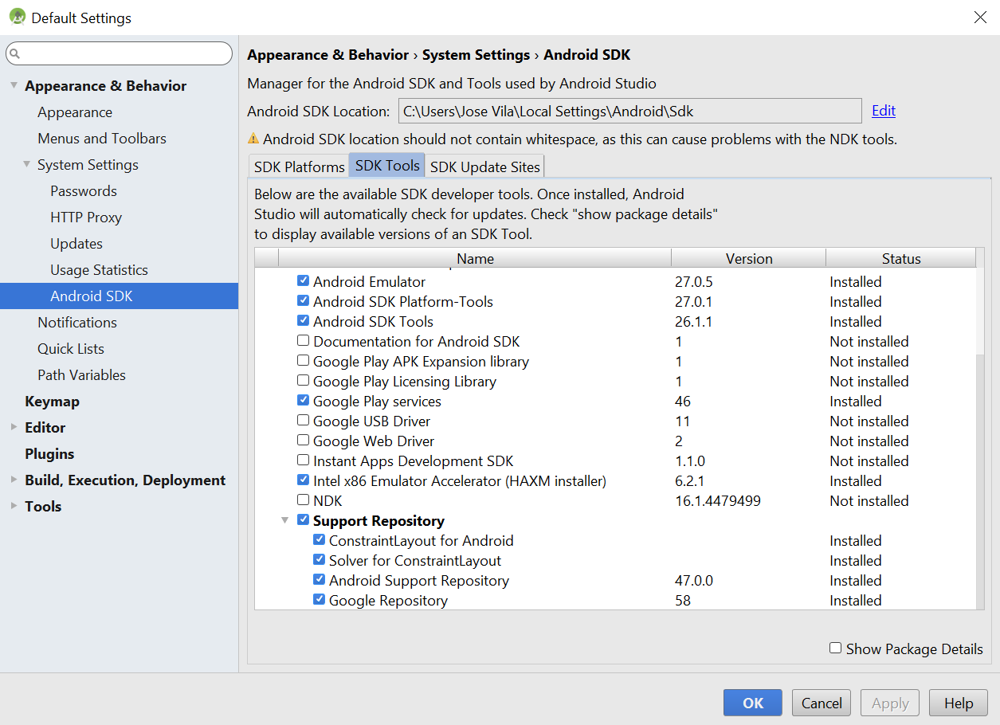

# Google Maps API and Location Services - First Principles Edition

## Resources

* [Google Maps API](https://developers.google.com/maps/documentation/android-api/)
* [Location Services](https://developer.android.com/guide/topics/location/index.html)

# Lecture

## Warm-Up - DO THIS FIRST!

Read through the documentation in the [Google Maps API](https://developers.google.com/maps/documentation/android-api/) to become familiar with the integration process.

## Google Maps API - First Principles

Just like with Views, Activities, RecyclerViews, Fragments, SharedPreferences, JSON Parsing, Internet Connectivity, Database Management, Background Services, and Notifications - it makes sense to first explore the bare minimum required for basic implementations, rather than their most optimal forms - in order to get a better understanding of the concepts at the very beginning of the learning process.

The Google Maps API, much like most other Google API's, is incredibly robust, with seemingly countless features (bells and whistles, so to speak), and seemingly infinite use cases. However, in today's lecture we will not spend time diving deep into various animated frament layouts for MapViews, and making Map location markers change based on itemview clicks, or address changes. Rather, we will focus on the absolute minimum necessary to create a map, interact with it via touch events, add markers based on exact locations, and access actual, current location data from a user's Android device.

### 1. Confirm your SDK Settings

In Android Studio, from the menu tab, select:

**Tools -> Android -> SDK Manager -> Appearance & Behavior -> System Settings -> Android SDK -> SDK Tools**

Once there, make sure that the following items have been checked-off/installed:

* Google Play Services
* Support Repository -> Google Repository

Your selections should look something like this:



Once all of these items have been installed, click Apply and Okay to move on....

### 2. Create a new Maps Activity

To create an Activity which will host our Map, we can simply auto-generate one by clicking:

**File -> New -> Google -> Google Maps Activity**

Once created, not only will you create a new Activity and corresponding XML Layout file, but an additional resources values file called `google_maps_api.xml` will also be created. Upon opening the file, you'll discover that Android Studio has made our lives easier by giving us instructions on where to create/find an API key, and how to place it within the file for future use.

### 3. Generate an API Key

After following the link created just for you when automatically creating the Maps Activity, generate an API key, copy it, then paste it into the string resource within the `google_maps_api.xml` file called `google_maps_key`.

### 4. Add `build.gradle` Gradle Dependencies

Add the following dependencies to your app's `build.gradle` file:

```groovy
implementation 'com.google.android.gms:play-services-location:11.8.0'
implementation 'com.google.android.gms:play-services-maps:11.8.0'
```

Additionally, confirm that `google()` has been added to the `repositories` code block in your project's `build.gradle` file:

```groovy
buildscript {
    
    repositories {
        google()
        jcenter()
    }

    dependencies {
        classpath 'com.android.tools.build:gradle:3.0.1'
        
        // NOTE: Do not place your application dependencies here; they belong
        // in the individual module build.gradle files
    }
}

allprojects {
    repositories {
        google()
        jcenter()
    }
}

task clean(type: Delete) {
    delete rootProject.buildDir
}
```

### 5. Add Permissions to your Manifest

In order to access the Internet, or get location information from your Android device, you'll need to add device permissions first. Add the following permissions to your `AndroidManifest.xml` file, above the application opening tag:

```xml
<uses-permission android:name="android.permission.INTERNET"/>
<uses-permission android:name="android.permission.ACCESS_FINE_LOCATION"/>
<uses-permission android:name="android.permission.ACCESS_COARSE_LOCATION"/>
```

### 6. Add Markers to the Map

When creating the MapActivity, much of the code will be auto-generated for you. However, it will be preset to mark "Sydney" as a singularly marked location. Let's create a new `LatLng` object to store the latitudinal/longitudinal location for New York City - City Hall:

```java
@Override
    public void onMapReady(GoogleMap googleMap) {
	mMap = googleMap;

        // Add a marker in Sydney and move the camera
	LatLng sydney = new LatLng(-34, 151);
	mMap.addMarker(new MarkerOptions().position(sydney).title("Marker in Sydney"));
	LatLng nyc = new LatLng(40.7128, -74.0060);
	mMap.addMarker(new MarkerOptions().position(nyc).title("Marker in NYC"));
	mMap.moveCamera(CameraUpdateFactory.newLatLng(sydney));
    }
```

### 7. Modify the Map

There are certain expectations a user has for using a Google Map. Although a search bar with autocomplete is a "nice-to-have," it's not required. Two things which are expected are zoom controls, and a current location locator button. We can do this by adding a `UiSettings` object - let's add those now:

```java
@Override
    public void onMapReady(GoogleMap googleMap) {
	mMap = googleMap;

        // Add a marker in Sydney and move the camera
	LatLng sydney = new LatLng(-34, 151);
	mMap.addMarker(new MarkerOptions().position(sydney).title("Marker in Sydney"));
	LatLng nyc = new LatLng(40.7128, -74.0060);
	mMap.addMarker(new MarkerOptions().position(nyc).title("Marker in NYC"));
	mMap.moveCamera(CameraUpdateFactory.newLatLng(nyc));

	UiSettings uiSettings = mMap.getUiSettings();
	uiSettings.setZoomControlsEnabled(true);
	uiSettings.setMyLocationButtonEnabled(true);
    }
```

### 8. Check Permissions and Enable the MyLocation Button

Right now, when the MyLocation button is pressed - nothing happens. This is because we have yet to enable the automatic setting of the current location. Unfortunately, even though we added permessions to our manifest for fine/course location, for Android API's 23 and above (Marshmallow and above), permissions must be obtained dynamically, as these are considered **Dangerous Permissions**.

We'll have to check first if the permissions we asked for first in the manifest were granted. If not, we'll have to ask the user for permission at runtime with an alert box. Let's do this now:

```java
if (ActivityCompat.checkSelfPermission(this, android.Manifest.permission.ACCESS_FINE_LOCATION) != PackageManager.PERMISSION_GRANTED ||
                ActivityCompat.checkSelfPermission(this, android.Manifest.permission.ACCESS_COARSE_LOCATION) != PackageManager.PERMISSION_GRANTED) {
	ActivityCompat.requestPermissions(this, new String[]{android.Manifest.permission.ACCESS_FINE_LOCATION, android.Manifest.permission.ACCESS_COARSE_LOCATION}, 1020);
} else {
	mMap.setMyLocationEnabled(true);
}
```

Excellent! We now have permissions! But what if we want to drop a pin for our most-recent location?

### 9. Detect most-recent location

Although we could easily jump to our location by pressing the MyLocation button, we might also want to get our actual coordinates, and place a pin on the map. We might even want to add those coordinates to a database, to map the pins again at a later date. We can do this by creating a `FusedLocationProviderClient` object, and calling `getLastLocation()` on it:

```java
public class MapsActivity extends FragmentActivity implements OnMapReadyCallback {

    private GoogleMap mMap;
    private FusedLocationProviderClient mFusedLocationClient;

    @Override
    protected void onCreate(Bundle savedInstanceState) {
        super.onCreate(savedInstanceState);
        setContentView(R.layout.activity_maps);
        // Obtain the SupportMapFragment and get notified when the map is ready to be used.
        SupportMapFragment mapFragment = (SupportMapFragment) getSupportFragmentManager()
                .findFragmentById(R.id.map);
        mapFragment.getMapAsync(this);
        mFusedLocationClient = LocationServices.getFusedLocationProviderClient(this);
    }
```

However, we simply can't get the location data from the `FusedLocationProviderClient` object - we'll have to wait for the callback response first:

```java
@Override
public void onMapReady(GoogleMap googleMap) {
	mMap = googleMap;
	if (ActivityCompat.checkSelfPermission(this, android.Manifest.permission.ACCESS_FINE_LOCATION) != PackageManager.PERMISSION_GRANTED ||
                ActivityCompat.checkSelfPermission(this, android.Manifest.permission.ACCESS_COARSE_LOCATION) != PackageManager.PERMISSION_GRANTED) {
		ActivityCompat.requestPermissions(this, new String[]{android.Manifest.permission.ACCESS_FINE_LOCATION, android.Manifest.permission.ACCESS_COARSE_LOCATION}, 1020);
	} else {
		mMap.setMyLocationEnabled(true);
		mFusedLocationClient.getLastLocation()
                    .addOnSuccessListener(this, new OnSuccessListener<Location>() {
                        @Override
                        public void onSuccess(Location location) {
                            // Got last known location. In some rare situations this can be null.
                            if (location != null) {
                                // Logic to handle location object
                                double lat = location.getLatitude();
                                double lng = location.getLongitude();
                                mMap.addMarker(new MarkerOptions().position(new LatLng(lat, lng)).title("Marker in NYC"));
                            }
                        }
                    });
        }

....

}
```

Awesome, we have our current location data! We've reached minimum viable product, so let's try to optimize a bit....

### 10. Changing the Marker Icon

So, let's say we want to make custom markers for certain locations ("Flying Saucers" for UFO Sightings, "Ghosts" for Haunted Houses, whatever), you can do this by adding to the Marker object an `.icon()` method - but instead of simply passing in an image, we'll have to pass in a factory that parses an image into an icon. The factory pattern simply creates an object based on the parameters passed in to request it. In this case, we know we're creating an icon based on a resource image:

```java
mMap.addMarker(new MarkerOptions().position(new LatLng(lat, lng)).title("Marker in NYC").icon(BitmapDescriptorFactory.fromResource(R.mipmap.ic_launcher_round)));
```

Great! We have a cool new icon! Right now, we're creating pins based on lattitude/longitude data - which is awesome, but also impractical if all we have is a street address, or a zip code, which brings us to our next optimization....

### 11. Placing a marker for a street address

We can get lat/lng data from a street address by creating a `GeoCoder` object, and parsing all the possible attempts at creating a valid lat/lng combination into a list. We can then grab the first object from the list, get its coordinates, and create a pin with it:

```java
Geocoder coder = new Geocoder(getApplicationContext());
            List<Address> address;
            LatLng p1 = null;

            try {
                // May throw an IOException
                address = coder.getFromLocationName("3105 Astoria Blvd S, Astoria, NY 11102", 5);
                if (address != null) {
                    Address location = address.get(0);
                    location.getLatitude();
                    location.getLongitude();
                    p1 = new LatLng(location.getLatitude(), location.getLongitude());
                    mMap.addMarker(new MarkerOptions().position(p1).title("Marker in Astoria - Neptune Diner").icon(BitmapDescriptorFactory.fromResource(R.mipmap.ic_launcher_round)));
                }
            } catch (IOException ex) {
                ex.printStackTrace();
            }
```

Excellent work! We collectively created our Google Maps implementation! Now that you know the basics, you can create your own fragments that implement `OnMapReadyCallback`, utilize `MapView` objects, or alter the map in a variety of ways - but that's up to you, and your particular needs....
