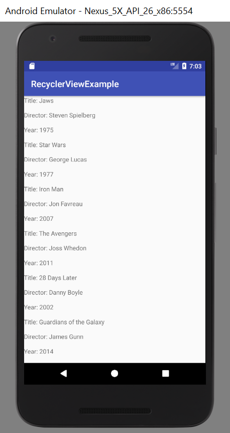

# RecyclerView Review: By The Recipe

## Objectives
* Fellows will review list concepts learned previously
* Fellows will create their own data models
* Fellows will implement LinearLayout-based RecyclerView which will display the model's data  

## Resources
* []()
* []()
* []()

# Lecture

To quote an applicable movie reference:

**Colette:** I know the Gusteau style cold. In every dish, Chef Gusteau always has something unexpected. I will show you. I memorize all his recipe.

**Linguini:** (writing in notebook) Always do something unexpected.

**Colette:** No. Follow the recipe.

**Linguini:** But you just said that...

**Colette:** (interrupts) No-no-no-no. It was *his* job to be unexpected. It is *our* job to...

**Colette, Linguini:** (together, as Linguini rewrites the advice) ... follow the recipe.

**-- Ratatouille, 2007**

## Practice, then Improvise

As with any skill, it's important to figure out the bare minimum for what is necessary to gain this skill, rather than seeking to be an expert from the very beginning.

The famous 18th century catholic polyglot, Cardinal Giuseppe Mezzofanti, spoke 30-plus languages fluently, and was familiar with upwards of 42 languages. He did this by taking the *Pater Noster* prayer, and painstakingly translating it into every new language he wanted to learn, to break down the individual steps that made each language unique.

Elon Musk, the co-founder of PayPal, and current CEO of both SpaceX and Tesla, referred to this technique as **first principles** - he is quoted as once saying "you boil things down to the most fundamental truths... and then reason up from there."

The same can be said for learning to code, especially views like Android's RecyclerView. We will break down the RecyclerView into simple, atomic, elemental steps - then, as you grow as developers, you'll be able to modify these steps to best fit your needs (make things clickable, move to other Activities, add pictures), and eventually read the source code, to make incredible things. So, let's begin:

### 1. Create a Model Class for the Data you want to Display

To separate concerns effectively, we should create a package called **model** (all lowercase) within your project just for our data models - or what we want our data to look like for use.

Next, we'll make a basic data class to store inside of our new package - a class for fun movies. It should have:

* Field variables for the title, director, and debut year
* Public Constructor to set the fields
* Getters for each instance field

```java
package nyc.c4q.recyclerviewexample.model;

public class Movie {
    String title;
    String director;
    String year;

    public Movie(String title, String director, String year) {
        this.title = title;
        this.director = director;
        this.year = year;
    }
    public String getTitle() {
        return title;
    }
    public String getDirector() {
        return director;
    }
    public String getYear() {
        return year;
    }
}
```

### 2. Insert a dependency into your app's build.gradle file

Oh, Gradle - the cause of, and solution to, all of life's problems. First, add this line of code to your app's build.gradle dependencies:

```groovy
compile 'com.android.support:recyclerview-v7:26.+'
```

If you've updated to Android Studio 3.0, you might have to add this line instead:

```groovy
implementation 'com.android.support:recyclerview-v7:26.+'
```

This will add the library to your build for use. This is a good thing. Once done, sync your gradle files.

### 3. Insert RecyclerView XML Widget

Go to the Activity layout xml file (or wherever you want your RecyclerView to be seen), and create a RecyclerView Widget:

```xml
<?xml version="1.0" encoding="utf-8"?>
<android.support.constraint.ConstraintLayout
    xmlns:android="http://schemas.android.com/apk/res/android"
    xmlns:app="http://schemas.android.com/apk/res-auto"
    xmlns:tools="http://schemas.android.com/tools"
    android:layout_width="match_parent"
    android:layout_height="match_parent"
    tools:context="nyc.c4q.recyclerviewexample.MainActivity">

    <android.support.v7.widget.RecyclerView
        android:id="@+id/movie_recyclerview"
        android:layout_width="match_parent"
        android:layout_height="match_parent"
        app:layout_constraintBottom_toBottomOf="parent"
        app:layout_constraintLeft_toLeftOf="parent"
        app:layout_constraintRight_toRightOf="parent"
        app:layout_constraintTop_toTopOf="parent"/>

</android.support.constraint.ConstraintLayout>
```
Make sure to give your RecyclerView widget an ID that makes sense (as with all your widgets), so that it will be easier to find in the future. You'll thank me later.

## 4. Reference the RecyclerView in your Activity's onCreate()

Like so:

```java
RecyclerView movieRecyclerView = (RecyclerView) findViewById(R.id.movie_recyclerview);
```

## 5. Create an ItemView Layout

Next, we'll want to create a container layout file, to organize our data, and repeat over-and-over again for display. We'll call it movie_itemview.xml, and store it in our layout resource folder:

```xml
<?xml version="1.0" encoding="utf-8"?>
<LinearLayout xmlns:android="http://schemas.android.com/apk/res/android"
              android:id="@+id/movie_itemview"
              android:layout_width="match_parent"
              android:layout_height="100dp"
              android:orientation="vertical">

    <TextView
        android:id="@+id/movie_title_textview"
        android:layout_width="match_parent"
        android:layout_height="0dp"
        android:layout_weight="1"/>

    <TextView
        android:id="@+id/movie_director_textview"
        android:layout_width="match_parent"
        android:layout_height="0dp"
        android:layout_weight="1"/>

    <TextView
        android:id="@+id/movie_year_textview"
        android:layout_width="match_parent"
        android:layout_height="0dp"
        android:layout_weight="1"/>

</LinearLayout>
```

### 6. Create a ViewHolder Class to set these view values dynamically

Create a package called **view** (all lowercase) within your project, just to store classes related to view assignment.

Next, create a ViewHolder class inside that folder, to set the values of the views within the itemview dynamically. Make sure to "extends" from RecyclerView.ViewHolder, and to create a constructor, that sets field variables to references to the itemView's child views:

```java
package nyc.c4q.recyclerviewexample.view;

import android.support.v7.widget.RecyclerView;
import android.view.View;
import android.widget.TextView;

import nyc.c4q.recyclerviewexample.R;
import nyc.c4q.recyclerviewexample.model.Movie;

public class MovieViewHolder extends RecyclerView.ViewHolder{

    private TextView title;
    private TextView director;
    private TextView year;

    public MovieViewHolder(View itemView) {
        super(itemView);
        title = (TextView) itemView.findViewById(R.id.movie_title_textview);
        director = (TextView) itemView.findViewById(R.id.movie_director_textview);
        year = (TextView) itemView.findViewById(R.id.movie_year_textview);
    }
}
```

If you'll notice, we put the parameter ```itemView``` in front of the ```findViewById()``` method, because we are setting the child views of the itemView being passed into this constructor.

### 7. Create an Adapter Class to bind data to each View

Create a package called **controller** (all lowercase) within your project, just to store classes responsible for passing model data to your view classes.

Create an Adapter class, so as to pass in, and bind your data to your views. Make sure to "extends" from RecyclerView.Adapter<vh>, and change the type parameter within the angle brackets to that of your ViewHolder class. After you do this, you will be asked to @Override 3 different methods - onCreateViewHolder(), onBindViewHolder(), and getItemCount():
    
```java
import nyc.c4q.recyclerviewexample.R;
import nyc.c4q.recyclerviewexample.model.Movie;
import nyc.c4q.recyclerviewexample.view.MovieViewHolder;

public class MovieAdapter extends RecyclerView.Adapter<MovieViewHolder>{

    @Override
    public MovieViewHolder onCreateViewHolder(ViewGroup parent, int viewType) {
        return null;
    }

    @Override
    public void onBindViewHolder(MovieViewHolder holder, int position) {
    
    }

    @Override
    public int getItemCount() {
        return 0;
    }
}
```

### 8. Create an List and a Constructor to accept a List of your datatype objects

```java
    private List<Movie> movieList;

    public MovieAdapter(List<Movie> movieList) {
        this.movieList = movieList;
    }
```

### 9. Update your onBindViewHolder() and getItemCount() methods based on this List

    @Override
    public void onBindViewHolder(MovieViewHolder holder, int position) {
        Movie movie = movieList.get(position);
    }

    @Override
    public int getItemCount() {
        return movieList.size();
    }
    
### 10. Inflate your itemView layout into your ViewHolder

```java
    @Override
    public MovieViewHolder onCreateViewHolder(ViewGroup parent, int viewType) {
        View childView = LayoutInflater.from(parent.getContext()).inflate(R.layout.movie_itemview, parent, false);
        return new MovieViewHolder(childView);
    }
```

When that's done, your class should look like this:

```java
package nyc.c4q.recyclerviewexample.controller;

import android.support.v7.view.menu.MenuView;
import android.support.v7.widget.RecyclerView;
import android.view.LayoutInflater;
import android.view.View;
import android.view.ViewGroup;

import java.util.List;

import nyc.c4q.recyclerviewexample.R;
import nyc.c4q.recyclerviewexample.model.Movie;
import nyc.c4q.recyclerviewexample.view.MovieViewHolder;

public class MovieAdapter extends RecyclerView.Adapter<MovieViewHolder>{

    private List<Movie> movieList;

    public MovieAdapter(List<Movie> movieList) {
        this.movieList = movieList;
    }

    @Override
    public MovieViewHolder onCreateViewHolder(ViewGroup parent, int viewType) {
        View childView = LayoutInflater.from(parent.getContext()).inflate(R.layout.movie_itemview, parent, false);
        return new MovieViewHolder(childView);
    }

    @Override
    public void onBindViewHolder(MovieViewHolder holder, int position) {
        Movie movie = movieList.get(position);
    }

    @Override
    public int getItemCount() {
        return movieList.size();
    }
}
```

### 11. Compose an onBind() method in your ViewHolder

Next, we'll want to assign data to each view in our ViewHolder, within the ViewHolder class. We can do this by creating our own onBind() method, that passes our data directly to our ViewHolder, when called in the onBindViewHolder() method on the Adapter class. We're doing this, because we want to keep data exchange decisions up to controller classes, and view assignment up to view classes. The following code should be in your ViewHolder class:

```java
    public void onBind(Movie movie) {
        title.setText("Title: " + movie.getTitle());
        director.setText("Director: " + movie.getDirector());
        year.setText("Year: " + movie.getYear());
    }
```

and it's method call should be in your Adapter's onBindViewHolder() method:

```java
    @Override
    public void onBindViewHolder(MovieViewHolder holder, int position) {
        Movie movie = movieList.get(position);
        
        holder.onBind(movie);
    }
```

Great! Let's add some data to this RecyclerView!

### 12. Create a list of objects to pass to the Adapter

```java
package nyc.c4q.recyclerviewexample;

import android.support.v7.app.AppCompatActivity;
import android.os.Bundle;
import android.support.v7.widget.LinearLayoutManager;
import android.support.v7.widget.RecyclerView;
import android.widget.LinearLayout;

import java.util.ArrayList;
import java.util.List;

import nyc.c4q.recyclerviewexample.controller.MovieAdapter;
import nyc.c4q.recyclerviewexample.model.Movie;

public class MainActivity extends AppCompatActivity {

    @Override
    protected void onCreate(Bundle savedInstanceState) {
        super.onCreate(savedInstanceState);
        setContentView(R.layout.activity_main);

        RecyclerView movieRecyclerView = (RecyclerView) findViewById(R.id.movie_recyclerview);

        List<Movie> movies = new ArrayList<>();
        movies.add(new Movie("Jaws", "Steven Spielberg", "1975"));
        movies.add(new Movie("Star Wars", "George Lucas", "1977"));
        movies.add(new Movie("Iron Man", "Jon Favreau", "2007"));
        movies.add(new Movie("The Avengers", "Joss Whedon","2011"));
        movies.add(new Movie("28 Days Later", "Danny Boyle", "2002"));
        movies.add(new Movie("Guardians of the Galaxy", "James Gunn", "2014"));
        movies.add(new Movie("Sneakers", "Phil Alden Robinson", "1992"));
        movies.add(new Movie("Clear and Present Danger", "Phillip Noyce", "1994"));
    }
}
```

### 13. Pass this List into an Adapter instance

```java
MovieAdapter movieAdapter = new MovieAdapter(movies);
```

### 14. Create a LinearLayoutManager Instance, to set Orientation

You'll need a LinearLayoutManager instance to organize your itemViews in the RecyclerView (Vertical/Horizontal, in reverse-order, etc.):

```java
LinearLayoutManager linearLayoutManager = new LinearLayoutManager(getApplicationContext(), LinearLayoutManager.VERTICAL, false);
```

If you don't care about adjusting the order of the way your itemViews are displayed on the screen, you can just use the default instance:

```java
LinearLayoutManager linearLayoutManager = new LinearLayoutManager(getApplicationContext());
```

### 15. Set the Adapter to your RecyclerView (the adapter instance you just created)

```java
movieRecyclerView.setAdapter(movieAdapter);
```

### 16. Set the LinearLayoutManager to your RecyclerView (the linearLayoutManager instance you just created)

```java
movieRecyclerView.setLayoutManager(linearLayoutManager);
```

### 17. Confirm that your onCreate() method looks good

Make sure it looks something like this:

```java
package nyc.c4q.recyclerviewexample;

import android.support.v7.app.AppCompatActivity;
import android.os.Bundle;
import android.support.v7.widget.LinearLayoutManager;
import android.support.v7.widget.RecyclerView;
import android.widget.LinearLayout;

import java.util.ArrayList;
import java.util.List;

import nyc.c4q.recyclerviewexample.controller.MovieAdapter;
import nyc.c4q.recyclerviewexample.model.Movie;

public class MainActivity extends AppCompatActivity {

        @Override
        protected void onCreate(Bundle savedInstanceState) {
        super.onCreate(savedInstanceState);
        setContentView(R.layout.activity_main);

        RecyclerView movieRecyclerView = (RecyclerView) findViewById(R.id.movie_recyclerview);

        List<Movie> movies = new ArrayList<>();
        movies.add(new Movie("Jaws", "Steven Spielberg", "1975"));
        movies.add(new Movie("Star Wars", "George Lucas", "1977"));
        movies.add(new Movie("Iron Man", "Jon Favreau", "2007"));
        movies.add(new Movie("The Avengers", "Joss Whedon","2011"));
        movies.add(new Movie("28 Days Later", "Danny Boyle", "2002"));
        movies.add(new Movie("Guardians of the Galaxy", "James Gunn", "2014"));
        movies.add(new Movie("Sneakers", "Phil Alden Robinson", "1992"));
        movies.add(new Movie("Clear and Present Danger", "Phillip Noyce", "1994"));

        MovieAdapter movieAdapter = new MovieAdapter(movies);
        LinearLayoutManager linearLayoutManager = new LinearLayoutManager(getApplicationContext(), LinearLayoutManager.VERTICAL, false);
        movieRecyclerView.setAdapter(movieAdapter);
        movieRecyclerView.setLayoutManager(linearLayoutManager);
    }
}
```

### 18. Run it, to make sure it compiles 🤞 🤞

It should look very much like this:



### 19. Happy Dance 🕺 💃🏽

Congrats! Take a break - you just made RecyclerView happen!

### 20. DO IT ALL OVER AGAIN 🙄

Practice makes permanent. Follow this process again and again, until it becomes second nature. It is highly likely that you will have a ListView requirement on a Coding Challenge from potential employers. Being able to produce a view like this on command will definitely make you a competitive candidate. So, consult this lesson frequently, and follow each step, to make sure you haven't missed anything. Then, when you're comfortable, add click listeners, intents, change layouts, even modify the way itemviews look based on what the user does!
