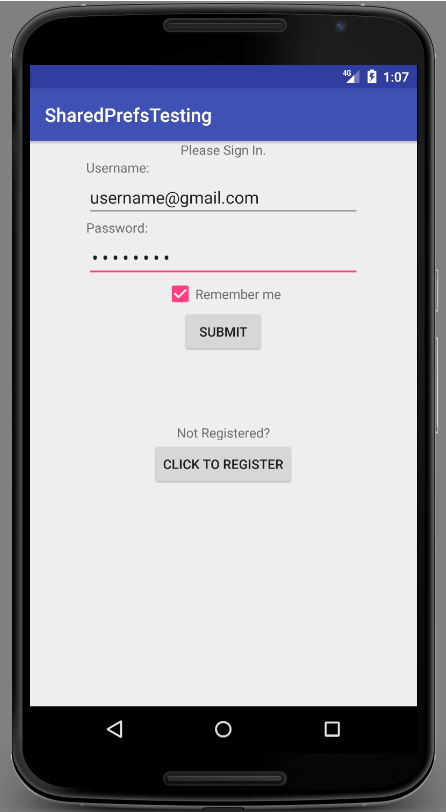

# Android Shared Preferences and Intents, Revisited

# Objectives

- Differences between RAM and Persistent Storage
- Utilize SharedPreferences and Intent Extras to store, recall, and exchange information

# Resources

- [Shared Preferences](https://developer.android.com/reference/android/content/SharedPreferences.html)
- [Android Storage Options](https://developer.android.com/guide/topics/data/data-storage.html#pref)
- [Shared Preferences Tutorial](https://developer.android.com/guide/topics/data/data-storage.html#pref)

# Lecture

Although we can use data structures in our apps, the data we store usually only lasts as long as the app, or activities within the app, are still active. One the activity is destroyed, so is the data. SharedPreferences allow us to save privitive data (and Strings too), well after the app has shut down.

## Shared Preferences

The Android SharedPreferences API allows developers to save key-value pairs of associated data (Maps, anyone?) in unique files that are accessible to activities/applications both throughout their lifecycles, as well as well after the phone has been shut down and restarted. SharedPreferences entries are usually used for storing app specific preferences, like sign-in information, whether a user wants to see instructions every time an app is loaded, etc.

One way to get/create a SharedPreferences file for your app, involves storing a reference to it within your activity:

```java
SharedPreferences sharedPrefs = getApplicationContext().getSharedPreferences("mySharedPrefs", MODE_PRIVATE);
```

We use ```getApplicationContext()``` because we want this data to be accessible to all of the activities that might run within this application's process. Then, we call the method ```getSharedPreferences("mySharedPrefs", MODE_PRIVATE)```, so that we can:
* First, get back a file associated with the String "mySharedPrefs"
* Second, if there is no file associated with that name, create one
* Third, make sure only this application has access to this data, since SharedPreferences are data collections which can potentially be accessed anywhere in the device, when given the right/wrong permissions

With this SharedPreferences object, we can now put key/value pairs, get key/value pairs, or replace key/value pairs of data for this application, whenever we want.

So, let's say we want to create an app that requires logging into it before we can use it. We'll need to create a login activity, to check if a user has registered. If they have, we can sign them in. If they've already registered, and signed in once, they might not want to have to sign in every time they open the app. We can give them the option to let the app "remember" their login information, so that the next time they open it up, they can simply press submit, with the user information already preloaded on the screen.

Here's the login activity's XML:

```XML
<?xml version="1.0" encoding="utf-8"?>
<LinearLayout
    xmlns:android="http://schemas.android.com/apk/res/android"
    xmlns:app="http://schemas.android.com/apk/res-auto"
    xmlns:tools="http://schemas.android.com/tools"
    android:layout_width="match_parent"
    android:layout_height="match_parent"
    android:orientation="vertical"
    tools:context="nyc.c4q.sharedprefstesting.MainActivity">

    <LinearLayout
        android:layout_weight="1"
        android:orientation="vertical"
        android:layout_width="match_parent"
        android:layout_height="0dp"
        android:layout_marginStart="60dp"
        android:layout_marginEnd="60dp">

        <TextView
            android:id="@+id/signin_textview"
            android:layout_width="match_parent"
            android:layout_height="wrap_content"
            android:gravity="center"
            android:text="Please Sign In."/>

        <TextView
            android:id="@+id/username_textview"
            android:layout_width="match_parent"
            android:layout_height="wrap_content"
            android:text="Username:"/>

        <EditText
            android:id="@+id/username_edittext"
            android:layout_width="match_parent"
            android:layout_height="wrap_content"
            android:hint="Enter Email Address"
            android:inputType="textWebEmailAddress"/>

        <TextView
            android:id="@+id/password_textview"
            android:layout_width="match_parent"
            android:layout_height="wrap_content"
            android:text="Password:"/>

        <EditText
            android:id="@+id/password_edittext"
            android:layout_width="match_parent"
            android:layout_height="wrap_content"
            android:hint="Enter Password"
            android:inputType="textWebPassword"/>

        <LinearLayout
            android:layout_width="match_parent"
            android:layout_height="wrap_content"
            android:gravity="center"
            android:orientation="horizontal">

            <android.support.v7.widget.AppCompatCheckBox
                android:id="@+id/remember_me_checkbox"
                android:layout_width="wrap_content"
                android:layout_height="wrap_content"/>

            <TextView
                android:layout_width="wrap_content"
                android:layout_height="wrap_content"
                android:text="Remember me"/>

        </LinearLayout>

        <Button
            android:id="@+id/submit_button"
            android:layout_width="wrap_content"
            android:layout_height="wrap_content"
            android:layout_gravity="center"
            android:text="Submit"/>

    </LinearLayout>

    <LinearLayout
        android:layout_weight="1"
        android:layout_width="match_parent"
        android:layout_height="0dp"
        android:orientation="vertical">

        <TextView
            android:layout_width="match_parent"
            android:layout_height="wrap_content"
            android:text="Not Registered?"
            android:gravity="center"/>

        <Button
            android:id="@+id/register_button"
            android:layout_width="wrap_content"
            android:layout_height="wrap_content"
            android:layout_gravity="center"
            android:text="Click to register"/>

    </LinearLayout>

</LinearLayout>
```

And this is what it should look like:


In our MainActivity.java file, we'll store references to our views, and our SharedPreferences file, so that we may interact with them:

```java
package nyc.c4q.sharedprefstesting;

import android.content.Intent;
import android.content.SharedPreferences;
import android.support.v7.app.AppCompatActivity;
import android.os.Bundle;
import android.view.View;
import android.widget.Button;
import android.widget.CheckBox;
import android.widget.EditText;

public class MainActivity extends AppCompatActivity {

    private static final String SHARED_PREFS_KEY = "sharedPrefsTesting";
    private EditText username;
    private EditText password;
    private CheckBox checkBox;
    private Button submitButton;
    private Button registerButton;
    private SharedPreferences login;

    @Override
    protected void onCreate(Bundle savedInstanceState) {
        super.onCreate(savedInstanceState);
        setContentView(R.layout.activity_main);

        username = (EditText) findViewById(R.id.username_edittext);
        password = (EditText) findViewById(R.id.password_edittext);
        checkBox = (CheckBox) findViewById(R.id.remember_me_checkbox);
        submitButton = (Button) findViewById(R.id.submit_button);
        registerButton = (Button) findViewById(R.id.register_button);

        login = getApplicationContext().getSharedPreferences(SHARED_PREFS_KEY, MODE_PRIVATE);

        submitButton.setOnClickListener(new View.OnClickListener() {
            @Override
            public void onClick(View view) {
                
            }
        });

        registerButton.setOnClickListener(new View.OnClickListener() {
            @Override
            public void onClick(View view) {
            
            }
        });
    }
}
```

If you'll notice, we have the String ```private static final String SHARED_PREFS_KEY = "sharedPrefsTesting";```, and we stored this String because we will be using it several times throughout our application - you'll see as we create the app further.

We then create/get a SharedPreferences reference, associated with the key "sharedPrefsTesting":

```login = getApplicationContext().getSharedPreferences(SHARED_PREFS_KEY, MODE_PRIVATE);```

We'll want to store the username and password entered into our EditTexts for future use ONLY if the checkbox next to "rememeber me" is ticked, and the "Submit" button has been clicked. We can do that by taking the SharedPreferences reference, and adding it to a ```SharedPreferences.Editor``` reference in the submit button's onClickListener. First, we check whether the checkbox has been ticked (```checkbox.isChecked()```), then we pass the ```SharedPreferences``` reference to the ```Editor```, because like Arrays and Strings, ```SharedPreferences``` are essentially immutable, and must be edited in a unique way:

```java
package nyc.c4q.sharedprefstesting;

import android.content.Intent;
import android.content.SharedPreferences;
import android.support.v7.app.AppCompatActivity;
import android.os.Bundle;
import android.view.View;
import android.widget.Button;
import android.widget.CheckBox;
import android.widget.EditText;

public class MainActivity extends AppCompatActivity {

    private static final String SHARED_PREFS_KEY = "sharedPrefsTesting";
    private EditText username;
    private EditText password;
    private CheckBox checkBox;
    private Button submitButton;
    private Button registerButton;
    private SharedPreferences login;

    @Override
    protected void onCreate(Bundle savedInstanceState) {
        super.onCreate(savedInstanceState);
        setContentView(R.layout.activity_main);

        username = (EditText) findViewById(R.id.username_edittext);
        password = (EditText) findViewById(R.id.password_edittext);
        checkBox = (CheckBox) findViewById(R.id.remember_me_checkbox);
        submitButton = (Button) findViewById(R.id.submit_button);
        registerButton = (Button) findViewById(R.id.register_button);

        login = getApplicationContext().getSharedPreferences(SHARED_PREFS_KEY, MODE_PRIVATE);

        submitButton.setOnClickListener(new View.OnClickListener() {
            @Override
            public void onClick(View view) {
                SharedPreferences.Editor editor = login.edit();
                if (checkBox.isChecked()) {
                    editor.putString("username", username.getText().toString());
                    editor.putString("password", password.getText().toString());
                    editor.putBoolean("isChecked", checkBox.isChecked());
                    editor.commit();
                } else {
                    editor.putBoolean("isChecked", checkBox.isChecked());
                    editor.commit();
                }
            }
        });

        registerButton.setOnClickListener(new View.OnClickListener() {
            @Override
            public void onClick(View view) {
            
            }
        });
    }
}
```

To store the values, we use a put method (very much like a Map), corresponding to its data type: ```int```, ```boolean```, ```String```, etc., we pass in a String key, and a value we want to associate with that key - in our case, the username text, the password text, and whether or not the checkbox has been ticked:

```java
editor.putString("username", username.getText().toString());
editor.putString("password", password.getText().toString());
editor.putBoolean("isChecked", checkBox.isChecked());
```

Finally, we add the line ```editor.commit();``` every time we run ```.edit()``` on the SharedPreferences reference, whenever we have finished adding key/value pairs of data.

For our logic we're adding an if/then statement, so that if the checkbox is not ticked, we can store that fact for anyone who wishes to check that in the future.

Let's say the user shuts down our app after a successful login. If they tick the checkbox, they'll expect that the next time they open the app, their information will be autofilled in. Let's do that for them now in our onCreate():

```java
package nyc.c4q.sharedprefstesting;

import android.content.Intent;
import android.content.SharedPreferences;
import android.support.v7.app.AppCompatActivity;
import android.os.Bundle;
import android.view.View;
import android.widget.Button;
import android.widget.CheckBox;
import android.widget.EditText;

public class MainActivity extends AppCompatActivity {

    private static final String SHARED_PREFS_KEY = "sharedPrefsTesting";
    private EditText username;
    private EditText password;
    private CheckBox checkBox;
    private Button submitButton;
    private Button registerButton;
    private SharedPreferences login;

    @Override
    protected void onCreate(Bundle savedInstanceState) {
        super.onCreate(savedInstanceState);
        setContentView(R.layout.activity_main);

        username = (EditText) findViewById(R.id.username_edittext);
        password = (EditText) findViewById(R.id.password_edittext);
        checkBox = (CheckBox) findViewById(R.id.remember_me_checkbox);
        submitButton = (Button) findViewById(R.id.submit_button);
        registerButton = (Button) findViewById(R.id.register_button);

        login = getApplicationContext().getSharedPreferences(SHARED_PREFS_KEY, MODE_PRIVATE);
        
        if (login.getBoolean("isChecked", false)) {
            username.setText(login.getString("username", null));
            password.setText(login.getString("password", null));
            checkBox.setChecked(login.getBoolean("isChecked", false));
        }

        submitButton.setOnClickListener(new View.OnClickListener() {
            @Override
            public void onClick(View view) {
                SharedPreferences.Editor editor = login.edit();
                if (checkBox.isChecked()) {
                    editor.putString("username", username.getText().toString());
                    editor.putString("password", password.getText().toString());
                    editor.putBoolean("isChecked", checkBox.isChecked());
                    editor.commit();
                } else {
                    editor.putBoolean("isChecked", checkBox.isChecked());
                    editor.commit();
                }
            }
        });

        registerButton.setOnClickListener(new View.OnClickListener() {
            @Override
            public void onClick(View view) {
            
            }
        });
    }
}
```

First, we check to see if the checkbox was ticked the last time the login info was submitted by running ```login.getBoolean("isChecked", false)``` as a conditional for the if statement. You'll see that the method takes two parameters:
* the key for the value we want
* a backup value, should the key not be there

This backup value actually makes sense, since it helps to return a value no matter what. It's precident to make your backup value the default value of the data type you are asking for - in this case, a boolean's default type is ```false```, so if no value was found for that key, we can still use the backup value that was passed in and returned to us.


Next, if the checkbox was ticked previously, we can now confidently set the text values of these EditTexts by using the keys associated with the username and password last entered. In the ```getString()``` method, we also pass in two arguments as parameters:

```java
username.setText(login.getString("username", null));
password.setText(login.getString("password", null));
```

You could just as easily pass in a backup String value of "", or an empty String literal rather than ```null``` - whichever you prefer, since you'll only be using that value if the key does not exist - which in our example, is not the case.

This ```if``` statement will only run if the SharedPreferences reference has an ```isChecked``` key with a ```true``` value associated with it.

After entering the data, ticking the checkbox, clicking submit, shutting down the app, then reopening it - you'll see that the data, and behavior, are in fact persistent!

However, our app should probably do something - let's have the user be moved to another activity after a successful login. We'll create a new activity, in a file called SecondActivity.java, and it's corresponding XML file:

```XML
<?xml version="1.0" encoding="utf-8"?>
<android.support.constraint.ConstraintLayout
    xmlns:android="http://schemas.android.com/apk/res/android"
    xmlns:app="http://schemas.android.com/apk/res-auto"
    xmlns:tools="http://schemas.android.com/tools"
    android:layout_width="match_parent"
    android:layout_height="match_parent"
    tools:context="nyc.c4q.sharedprefstesting.SecondActivity">

    <TextView
        android:id="@+id/session_message_textview"
        android:layout_width="match_parent"
        android:layout_height="wrap_content"
        android:text="You have just Signed In!"/>

</android.support.constraint.ConstraintLayout>
```

But how do we get to this activity? With an intent, called at the end of the submitButton's onClickListener logic:

```java
submitButton.setOnClickListener(new View.OnClickListener() {
            @Override
            public void onClick(View view) {
                SharedPreferences.Editor editor = login.edit();
                if (checkBox.isChecked()) {
                    editor.putString("username", username.getText().toString());
                    editor.putString("password", password.getText().toString());
                    editor.putBoolean("isChecked", checkBox.isChecked());
                    editor.commit();
                } else {
                    editor.putBoolean("isChecked", checkBox.isChecked());
                    editor.commit();
                }
                
                Intent intent = new Intent(MainActivity.this, SecondActivity.class);
                startActivity(intent);
            }
        });
```

First, we instantiate an intent object, and pass in two arguments:
* the activity we started in: ```MainActivity.this```
* the activity we want to go to: ```SecondActivity.class```

Then, we pass that reference to the ```startActivity()``` method, which stops the current activity, adds it to a backstack, and brings the next activity into view.

Right now though, all the activity currently displays is the text "You have just Signed In!", which isn't terribly unique to a user. In the MainActivity's intent, we can pass along the username to the next activity, by passing in an intent extra:

```java
Intent intent = new Intent(MainActivity.this, SecondActivity.class);
intent.putExtra("currentUser", username.getText().toString());
startActivity(intent);
```

Next, in SecondActivity.java, we can access that String from the intent that brought that activity into view with the ```intent.getIntent()``` method:

```java
package nyc.c4q.sharedprefstesting;

import android.content.Intent;
import android.support.v7.app.AppCompatActivity;
import android.os.Bundle;
import android.widget.TextView;

public class SecondActivity extends AppCompatActivity {

    @Override
    protected void onCreate(Bundle savedInstanceState) {
        super.onCreate(savedInstanceState);
        setContentView(R.layout.activity_second);
        TextView textView = (TextView) findViewById(R.id.session_message_textview);
        Intent intent = getIntent();
        String user = intent.getStringExtra("currentUser");
        textView.setText("You are currently signed in as: " + user);
    }
}
```

After entering our credentials and clicking on submit:



We should then see our unique message in the next activity:


Pretty good so far! We've come a long way - but we can still do more! At this point in our app, anyone who enters credentials, can sign into the app by pressing ```Submit``` - Let's locally store user information, by registering individual users, and saving that information using SharedPreferences. That way, unless a user is registered first, they won't be able to sign in!

First, let's create another activity called RegisterActivity.java, and edit its corresponding XML file:

```XML
<?xml version="1.0" encoding="utf-8"?>
<LinearLayout
    xmlns:android="http://schemas.android.com/apk/res/android"
    xmlns:app="http://schemas.android.com/apk/res-auto"
    xmlns:tools="http://schemas.android.com/tools"
    android:layout_width="match_parent"
    android:layout_height="match_parent"
    android:orientation="vertical"
    tools:context="nyc.c4q.sharedprefstesting.RegisterActivity">

    <LinearLayout
        android:orientation="vertical"
        android:layout_width="match_parent"
        android:layout_height="match_parent"
        android:layout_marginStart="60dp"
        android:layout_marginEnd="60dp">

        <TextView
            android:id="@+id/signin_textview"
            android:layout_width="match_parent"
            android:layout_height="wrap_content"
            android:gravity="center"
            android:text="Please Register."/>

        <TextView
            android:id="@+id/username_textview"
            android:layout_width="match_parent"
            android:layout_height="wrap_content"
            android:text="Username:"/>

        <EditText
            android:id="@+id/register_username_edittext"
            android:layout_width="match_parent"
            android:layout_height="wrap_content"
            android:hint="Enter Email Address"
            android:inputType="textWebEmailAddress"/>

        <TextView
            android:id="@+id/password_textview"
            android:layout_width="match_parent"
            android:layout_height="wrap_content"
            android:text="Password:"/>

        <EditText
            android:id="@+id/register_password_edittext"
            android:layout_width="match_parent"
            android:layout_height="wrap_content"
            android:hint="Enter Password"
            android:inputType="textWebPassword"/>

        <TextView
            android:id="@+id/confirm_password_textview"
            android:layout_width="match_parent"
            android:layout_height="wrap_content"
            android:text="Confirm Password:"/>

        <EditText
            android:id="@+id/confirm_password_edittext"
            android:layout_width="match_parent"
            android:layout_height="wrap_content"
            android:hint="Re-Enter Password"
            android:inputType="textWebPassword"/>

        <Button
            android:id="@+id/submit_button"
            android:layout_width="wrap_content"
            android:layout_height="wrap_content"
            android:layout_gravity="center"
            android:text="Submit"/>

    </LinearLayout>

</LinearLayout>
```

Next, let's fill in some logic that does several things:
* First, checks to see if the password entered is consistent
* Second, we are using the same SharedPreferences file as our login activity, and
* Third, updates our SharedPreferences with unique key/value pairs so that, when correctly enetered, will allow the user to log in successfully

Let's try that now! In our MainActivity, we should use an intent to move to the RegisterActivity, and pass it the same SharedPreferences key we used to remember a user's credentials. We can do that with an extra, placed in the register button;s onClickListener():

```java
registerButton.setOnClickListener(new View.OnClickListener() {
            @Override
            public void onClick(View view) {
                Intent intent = new Intent(MainActivity.this, RegisterActivity.class);
                intent.putExtra("testKey", SHARED_PREFS_KEY);
                startActivity(intent);
            }
        });
```

Next, we'll modify our RegisterActivity's onCreate() to include the intent and the SharedPreferences file:

```java
package nyc.c4q.sharedprefstesting;

import android.content.Intent;
import android.content.SharedPreferences;
import android.support.v7.app.AppCompatActivity;
import android.os.Bundle;
import android.view.View;
import android.widget.Button;
import android.widget.EditText;
import android.widget.Toast;

public class RegisterActivity extends AppCompatActivity {
    private SharedPreferences registerPrefs;
    private EditText userName;
    private EditText password;
    private EditText confirmPassword;
    private Button submitButton;

    @Override
    protected void onCreate(Bundle savedInstanceState) {
        super.onCreate(savedInstanceState);
        setContentView(R.layout.activity_register);

        userName = (EditText) findViewById(R.id.register_username_edittext);
        password = (EditText) findViewById(R.id.register_password_edittext);
        confirmPassword = (EditText) findViewById(R.id.confirm_password_edittext);
        submitButton = (Button) findViewById(R.id.submit_button);

        Intent intent = getIntent();
        registerPrefs = getApplicationContext().getSharedPreferences(intent.getStringExtra("testKey"), MODE_PRIVATE);

        submitButton.setOnClickListener(new View.OnClickListener() {
            @Override
            public void onClick(View view) {
                SharedPreferences.Editor editor = registerPrefs.edit();
                if (userName.getText() != null &&
                        password.getText() != null &&
                        confirmPassword.getText() != null &&
                        password.getText().toString().equals(
                                confirmPassword.getText().toString()
                        )) {
                    editor.putString("user" + userName.getText().toString(), userName.getText().toString());
                    editor.putString("password" + userName.getText().toString(), password.getText().toString());
                    editor.commit();
                    finish();
                }
            }
        });
    }
}
```

You'll see that after we've called ```commit()``` on out editor reference, we've written ```finish()``` - this destroys the activity, since once the data is added to SharedPreferences, we'll no long need the activity, and we'll want our user to be able to immediately sign in after registration. If the person using the app wants to register a new user, they can simply click on the register button again, and repeat the whole process!

In order to save the username and password during registration, we had to make each key unique. we couldn't use the password as a key to the password itself, since we'd need to compare it to a username first. This is why we created two new keys, a user key which resulted from concatinating the word "user" with whatever the username was, and the password key, which resulted from concatenating the word "password" to whatever the username was as well. The value for thir first key would be the actual username, and the value of the second key would be the actual password.

Now, whenever we want to check if the credentials are valid, no matter what the credentials may be, we can compare them using concatenation in the same wayin our submitButton's onClickListener:

```java
submitButton.setOnClickListener(new View.OnClickListener() {
            @Override
            public void onClick(View view) {
                SharedPreferences.Editor editor = login.edit();
                if (checkBox.isChecked()) {
                    editor.putString("username", username.getText().toString());
                    editor.putString("password", password.getText().toString());
                    editor.putBoolean("isChecked", checkBox.isChecked());
                    editor.commit();
                } else {
                    editor.putBoolean("isChecked", checkBox.isChecked());
                    editor.commit();
                }
                
                String checkUser = "user" + username.getText().toString();
                String checkPassword = "password" + username.getText().toString();
                
                if (username.getText().toString().equalsIgnoreCase(login.getString(checkUser, null))
                        && password.getText().toString().equals(login.getString(checkPassword, null))) {
                    Intent intent = new Intent(MainActivity.this, SecondActivity.class);
                    intent.putExtra("currentUser", username.getText().toString());
                    startActivity(intent);
                }
            }
        });
```

Great! We were able to leverage the power of Intents and SharedPreferences to create and maintain persistant states within our app!
